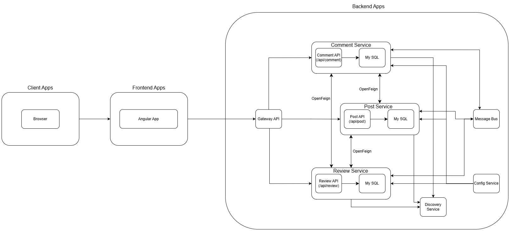

# Architecture

# Frontend
* Angular Frontend: De gebruikersinterface, ontwikkeld met Angular, stelt gebruikers in staat om met het systeem te communiceren.

# Backend Services
* API Gateway: Dit is het toegangspunt naar de backend en zorgt ervoor dat verzoeken van de frontend naar de juiste microservices worden geleid. Het regelt load balancing, authenticatie en service discovery.

* PostService: Beheert alle bewerkingen met betrekking tot berichten. Het communiceert met andere services zoals ReviewService en CommentService via 

* OpenFeign, een declaratieve REST-client.
 
* ReviewService: Verantwoordelijk voor het beheer van reviews die aan berichten gekoppeld zijn. Het werkt samen met PostService en CommentService om gerelateerde gegevens op te halen, met behulp van OpenFeign voor communicatie tussen de services.
 
* CommentService: Beheert reacties op berichten en reviews. Deze service haalt relevante informatie op van PostService en ReviewService om reacties te verwerken.
 
* Message Bus / RabbitMQ: Behandelt asynchrone communicatie tussen services via berichtwachtrijen. Bijvoorbeeld, wanneer gebeurtenissen in de PostService plaatsvinden, kunnen berichten naar de NotificationService worden gestuurd om gebruikers te informeren.
 
* NotificationService: Verantwoordelijk voor het versturen van meldingen naar gebruikers op basis van gebeurtenissen van andere services. Het luistert naar berichten van RabbitMQ om meldingen te verwerken.
 
* ConfigService: Beheert de configuratie-instellingen van het systeem en biedt een gecentraliseerde configuratie voor alle services.
 
* DiscoveryService: Stelt services in staat elkaar dynamisch te vinden en efficiënt te communiceren, wat bijdraagt aan load balancing en schaalbaarheid.

# Communicatiestromen
 
* Inter-service Communicatie
 
 * OpenFeign: Wordt gebruikt voor synchrone communicatie tussen PostService, ReviewService en CommentService. Hiermee kunnen efficiënte RESTful-aanroepen binnen het systeem worden gedaan, zodat services direct gegevens van elkaar kunnen opvragen.

 * RabbitMQ: Zorgt voor asynchrone communicatie, voornamelijk tussen services die real-time meldingen nodig hebben. Gegevens van ReviewService en CommentService worden bijvoorbeeld via RabbitMQ naar NotificationService gestuurd.

 
* Service Discovery
 * De DiscoveryService maakt het mogelijk dat services elkaar dynamisch vinden, wat essentieel is in gedistribueerde omgevingen. Services registreren zich bij DiscoveryService en gebruiken het om andere instanties te vinden.

* Configuratiebeheer
 * ConfigService slaat en beheert de configuraties voor elke microservice centraal. Deze aanpak vereenvoudigt het updaten van configuraties en zorgt voor consistentie door het hele systeem.

